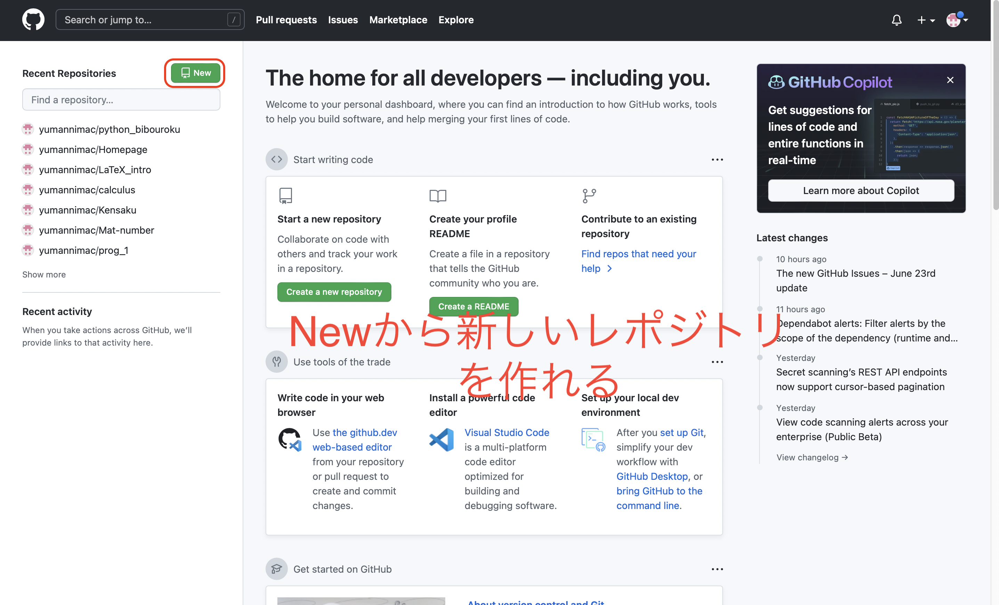

<script src="main.js"></script>

<script type="text/javascript" id="MathJax-script" async=""
src="https://cdn.jsdelivr.net/npm/mathjax@3/es5/tex-mml-chtml.js">
</script>
<script>
MathJax = {
oader: { load: ['[tex]/physics', '[tex]/newcommand', '[tex]/mathtools'] },
tex: {
inlineMath: [['$', '$'], ['\(', '\)']],
packages: { '[+]': ['physics', 'newcommand', 'mathtools'] },
},
chtml: {
matchFontHeight: false
}
};
</script>

<style>
img{
width:70%
}
video{
width:70%
}
</style>

# GithubPagesでホームページ作成

- [GithubPagesでホームページ作成](#githubpagesでホームページ作成)
	- [Githubに登録](#githubに登録)
	- [pagesでページを作る](#pagesでページを作る)


## Githubに登録

[Github公式](https://github.com)にアクセスする。


表示が出るのでまだメールアドレスを追加してない人は追加する。なおgithubはupgradeしない限り無料で使えるしこの記事に書いたことは無料でできる。（一ヶ月間したらサブスクが始まるみたいなことはこの記事を書いている現在(2022/06/24)にはない。


<video controls controles poster="">
<source src="mypage_sfiles/SS_9.mov">
</source>
</video>

追加して一通り終わる。



Newを押すとこの画面が出てくる。


`Repository name`に名前を入力して（今回は`sample`）`Create a Repository`を押す。


あとは一からファイルを作る`create a new file`とローカルかアップロードする`uploading an existing file`から選ぶ。


## pagesでページを作る

Githubではmarkdown形式の入力がサポートされるようになった。この記事のサンプルページではmarkdownで入力する。
markdownの記法自体はググれば結構ヒットするので省略する。


今回は新しく一からファイルを作る。（uploadもできる）`Name your file...`のところに`index.md`と入力。（基本名を`index`にしないと後の手順でホームページとしてブラウザに表示されないので注意。）このファイル名で差別化しなくても1レポジトリで記事は一つしか書けないので大丈夫。ちなみにレポジトリを複数増やせば記事を増やせるしそれは無限にできる。

uploadする場合もindexにすることに注意。upload自体はdrag and dropで簡単。

自分で編集したhtmlをアップしたければ名前を`index.html`とする。そのままhtmlの記法で入力すれば同様にページができる。

なおmarkdownを使う場合はcss等は勝手に付け足してくれる。

次に例えば以下を入力する。（記事の内容）

```markdown
# 見出し1 
## 見出し2 
これはsample記事です。
```
入力したら一番下の`Commit new file`を押す。Codeの画面に移動するのでsettings->pages->sourceからBranchをmain（少し前まではmasterだったらしい）に変更する。

<video controls controles poster="">
<source src="mypage_sfiles/SS_10.mov">
</source></video>

するとYour site is ready to be published at https://yumannimac.github.io/sample/が出てくる。


数分経って再読み込みすると緑色になる。


リンクをクリックするとページができている。


内容を変更したければ再びCodeから選択すれば可能。

<video controls controles poster="">
<source src="mypage_sfiles/SS_12.mov">
</source>
</video>

今回作ったサンプルページはこちら:  
[https://yumannimac.github.io/sample/](https://yumannimac.github.io/sample/)


<script src="https: //blz-soft.github.io/md_style/release/v1.2/md_style.js" ></script>
